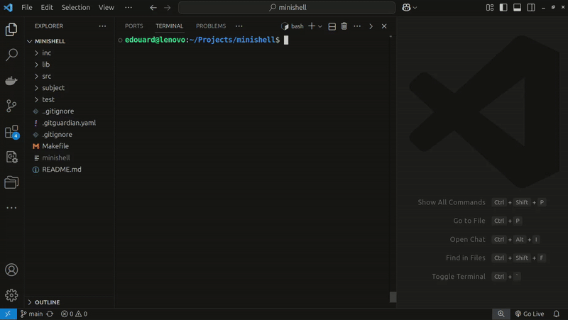

# Minishell (42 Barcelona)

**The "Minishell" project from 42 School recreates a simple Unix shell in C, featuring: command parsing, command execution, environment management, heredoc handling, multi infiles our outfiles support, readline history and 7 builtins.**

- **Subject:** [English](subject/en.subject.pdf) / [Spanish](subject/es.subject.pdf)
- **Location:** 42 School Barcelona
- **Validation:** March 2025



## How to use

### Installation

1. **Clone the repository:**
   ```bash
   git clone https://github.com/your-username/minishell.git
   cd minishell
   ```
2. **Compile the project:**
	Use the provided Makefile to compile the Minishell executable.
	```bash
	make
	```
3. **Run Minishell:**
	```bash
	./minishell
	```
	Minishell only work in interactive mode, so no arguments are allowed for this command.

### Basic Usage

Once Minishell is running, you will see a prompt `minishell$` where you can enter commands. Here are some examples of what you can do:

- **Execute commands:**

	```bash
	minishell$ ls -l
	minishell$ echo "Hello, World!"
	```

- **Pipes**

	You can use an unlimited number of pipes.
	```bash
	minishell$ ls -l | grep .c
	minishell$ cat file.txt | wc -l
	```

- **Built-in commands**

	Minishell supports the following builtins: `echo`, `cd`, `pwd`, `env`, `export`, `unset`, `exit`
	```bash
	minishell$ cd /path/to/directory
	minishell$ pwd
	minishell$ exit
	```

- **Redirections**

	```bash
	minishell$ echo "Hello" > output.txt
	minishell$ cat < input.txt
	minishell$ ls -l >> output.txt
	```

- **Heredoc**

	You can use an unlimited number of heredocs in you command, either seperated by pipes or in one sub-command.
	```bash
	minishell$ cat << EOF
	```

- **Variables expansion:**

	Environment variables:
	```bash
	minishell$ echo $HOME
	minishell$ export MY_VAR="42"
	minishell$ echo $MY_VAR
	```
	Error codes:
	```bash
	minishell$ cat -invalidoption
	minishell$ echo $?
	```
	HOME path:
	```bash
	minishell$ cd ~
	```

## Other features

- **Signals**

	Minishell handles the following signals (including inside heredoc interactive mode):
	- **Ctrl+C (SIGINT):** Interrupts the current command and displays a new prompt.
	- **Ctrl+D (EOF):** Exits the shell gracefully.
	- **Ctrl+\ (SIGQUIT):** Quits the shell (if no command is running).

- **Multi infiles and outfiles**

	Minishell is handling an unfinite number of infiles and outfiles. So, even if this command makes no sense, Minishell will treat it like `bash` would:
	```bash
	minishell$ < a << b << EOF cat > c >> d | << EOF < e sort >> f > g
	```
- **Readline history**

	Use arrows `UP` and `DOWN` to display your previous prompts.

- **Leaks free**

	Minishell guaranties no memory / file descriptors leaks except the ones causes natively by the readline library. Use this command to run Minishell in debug mode:
	```bash
	make valgrind
	```

## Project constraints

### Allowed functions:

**Readline Library Functions**
- `readline(prompt)`: Displays a prompt (e.g., minishell$ ) and waits for user input. Returns the input string (dynamically allocated).
- `rl_clear_history()`: Clears the history of commands entered via readline.
- `rl_on_new_line()`: Notifies the readline library that the cursor is on a new line (used after signals like CTRL+C).
- `rl_replace_line(new_line, clear_undo)`: Replaces the current input line with new_line. The clear_undo parameter specifies whether to reset undo history.
- `rl_redisplay()`: Refreshes and redraws the current line in the terminal.
- `add_history(line)`: Adds the given line to the command history.

**Standard C Library Functions**
- `malloc(size)`: Allocates size bytes of memory and returns a pointer to it.
- `free(ptr)`: Frees memory previously allocated with malloc.
- `write(fd, buffer, count)`: Writes count bytes from buffer to the file descriptor fd.

**File and Directory Management**
- `access(path, mode)`: Checks if the path exists and if the program has the specified mode (e.g., read/write).
- `open(path, flags)`: Opens a file at path with the specified flags (e.g., O_RDONLY for read-only).
- `read(fd, buffer, count)`: Reads up to count bytes from file descriptor fd into buffer.
- `close(fd)`: Closes the file descriptor fd.

**Process Management**
- `fork()`: Creates a new process by duplicating the current one (parent and child).
- `wait(status)`: Waits for any child process to finish and stores its exit status.
- `waitpid(pid, status, options)`: Waits for a specific child process (pid) to finish.
- `wait3(status, options, usage)`: Like wait, but also returns resource usage.
- `wait4(pid, status, options, usage)`: Like waitpid, but also returns resource usage.

**Signal Handling**
- `signal(signum, handler)`: Sets a handler function for the signal signum.
- `sigaction(signum, act, oldact)`: Sets signal behavior with more options than signal.
- `sigemptyset(set)`: Initializes a signal set to be empty.
- `sigaddset(set, signum)`: Adds a signal signum to the set.
- `kill(pid, sig)`: Sends the signal sig to the process with ID pid.

**Exit and Environment**
- `exit(status)`: Terminates the current process with the given status.
- `getcwd(buffer, size)`: Gets the current working directory and stores it in buffer.
- `chdir(path)`: Changes the current working directory to path.

**File Information**
- `stat(path, buf)`: Retrieves information about a file or directory (buf).
- `lstat(path, buf)`: Like stat, but retrieves info about symbolic links instead of the target file.
- `fstat(fd, buf)`: Like stat, but works with an open file descriptor fd.

**File Operations**
- `unlink(path)`: Deletes a file or symbolic link at path.
- `execve(path, argv, envp)`: Replaces the current process with a new program specified by path.

**I/O and Piping**
- `dup(fd)`: Duplicates a file descriptor fd.
- `dup2(oldfd, newfd)`: Duplicates oldfd to newfd, closing newfd first if necessary.
- `pipe(fds)`: Creates a pipe (a pair of file descriptors for inter-process communication).

**Directory Operations**
- `opendir(path)`: Opens a directory stream for the directory at path.
- `readdir(dir)`: Reads the next entry in the directory stream dir.
- `closedir(dir)`: Closes the directory stream dir.

**Error Handling**
- `strerror(errno)`: Returns a string describing the error corresponding to errno.
- `perror(message)`: Prints a custom message followed by the last error.

**Terminal Handling**
- `isatty(fd)`: Checks if the file descriptor fd refers to a terminal.
- `ttyname(fd)`: Returns the name of the terminal associated with fd.
- `ttyslot()`: Returns the slot number of the terminal in /etc/ttys.
- `ioctl(fd, request, ...)`: Sends a control request to the terminal or device fd.

**Environment Variables**
- `getenv(name)`: Returns the value of the environment variable name.

**Terminal Capabilities (Termcap)**
- `tcsetattr(fd, termios)`: Sets terminal attributes for fd.
- `tcgetattr(fd, termios)`: Gets terminal attributes for fd.
- `tgetent(buffer, termtype)`: Loads terminal capabilities for termtype.
- `tgetflag(capname)`: Checks if a terminal capability (capname) is available.
- `tgetnum(capname)`: Gets the numeric value of a terminal capability (capname).
- `tgetstr(capname, buffer)`: Gets the string value of a terminal capability (capname).
- `tgoto(capname, col, row)`: Computes a cursor movement string to position (col, row).
- `tputs(string, affcnt, putc)`: Outputs a terminal capability string (string) with the given number of affected lines (affcnt). Behaviour : Should match Bash as close as possible.

## External references:

- https://medium.com/@WinnieNgina/guide-to-code-a-simple-shell-in-c-bd4a3a4c41cd
- https://www.rozmichelle.com/pipes-forks-dups/
- https://medium.com/@mostafa.omrane/mes-conseils-si-je-devais-recommencer-minishell-a9783c51ba1b
